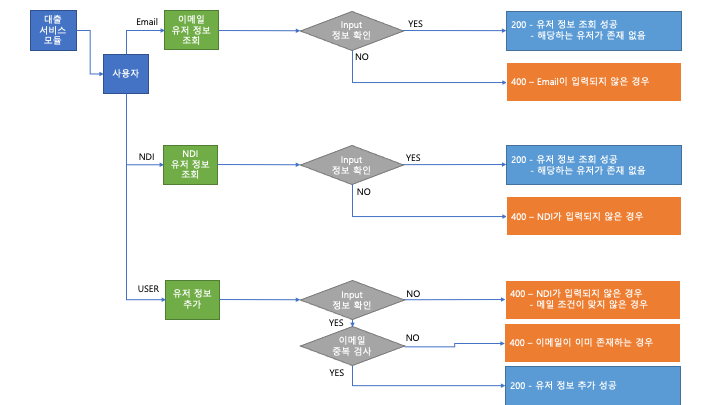
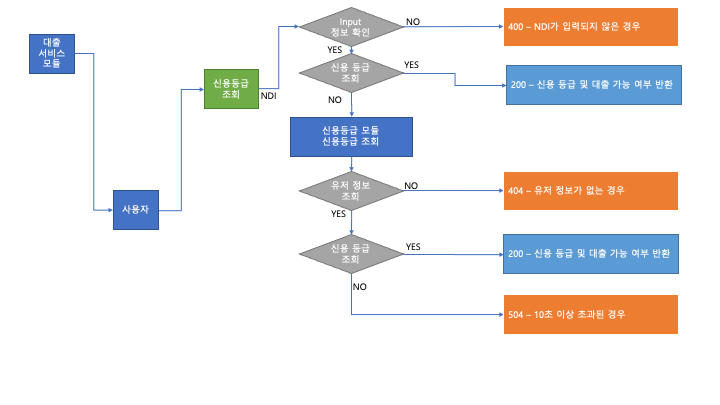
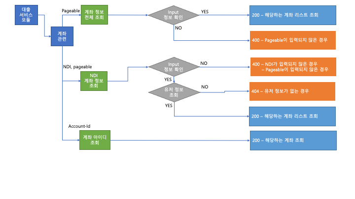
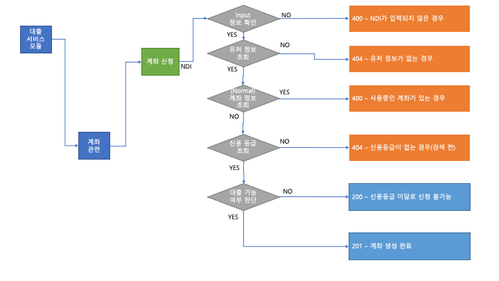
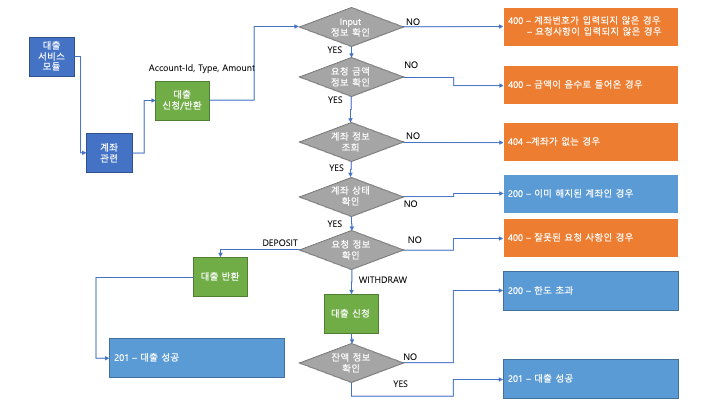
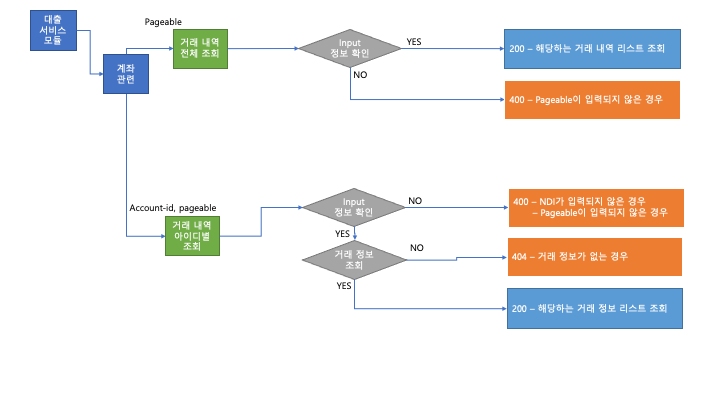
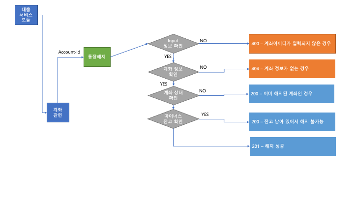

# 202108-internship-loan-system

## REST 명세서


## 플로우 차트

### 유저 정보 검색 및 추가


### 신용등급 조회


### 계좌 정보 조회


### 마이너스 통장 신청


### 대출 신청 및 반환


### 거래 내역 조회


### 통장 해지



## 데이터베이스

### E-R 다이어그램


### 데이터베이스 Create 생성문

```SQL

-- UserDB
CREATE TABLE user(
    NDI VARCHAR(36) PRIMARY KEY,
    email VARCHAR(50) not null unique,
    user_name VARCHAR(10) not null,
    age INT NOT NULL,
    salary INT NOT NULL
);

CREATE TABLE user_credit_rating(
    NDI VARCHAR(36) PRIMARY KEY,
    grade INT NOT NULL,
    isPermit BOOLEAN NOT NULL,
    created_date DATETIME NOT NULL default(NOW()),
    FOREIGN KEY(NDI) REFERENCES user(NDI)
);

-- CreditDB
CREATE TABLE credit_rating_search_history(
    history_id INT PRIMARY KEY AUTO_INCREMENT,
    NDI VARCHAR(36) NOT NULL,
    grade INT NOT NULL,
    created_date DATETIME NOT NULL default(NOW())
);

CREATE TABLE credit_rating_search_result(
    NDI VARCHAR(36) PRIMARY KEY,
    grade INT NOT NULL,
    history_id INT NOT NULL,
    isPermit BOOLEAN NOT NULL,
    FOREIGN KEY(history_id) references credit_rating_search_history(history_id)
);

-- AccountDB
CREATE TABLE account(
    account_id INT PRIMARY KEY AUTO_INCREMENT,
    account_number VARCHAR(50) NOT NULL UNIQUE,
    NDI VARCHAR(36) NOT NULL,
    loan_limit INT NOT NULL,
    balance INT NOT NULL,
    grade INT NOT NULL,
    status VARCHAR(15) NOT NULL default("normal"),
    created_date DATETIME NOT NULL default(NOW()),
    cancelled_date DATETIME
);

ALTER TABLE account ADD INDEX (account_number);

CREATE TABLE account_transaction_history(
    history_id INT PRIMARY KEY AUTO_INCREMENT,
    account_id INT NOT NULL,
    account_number VARCHAR(30) NOT NULL,
    amount INT NOT NULL,
    type VARCHAR(15) NOT NULL,
    translated_date DATETIME NOT NULL default(NOW()),
    FOREIGN KEY(account_id) REFERENCES account(account_id),
    FOREIGN KEY(account_number) REFERENCES account(account_number)
);

CREATE TABLE account_cancellation_history(
    account_id INT PRIMARY KEY,
    cancellation_date DATETIME NOT NULL,
    FOREIGN KEY(account_id) REFERENCES account(account_id)
);

```

## 실행방법

1. Docker를 통해서 서버 3개 실행
```
docker run -p 43306:3306 --name AccountDB -e MYSQL_ROOT_PASSWORD=naver -e MYSQL_DATABASE="account" -d mysql:latest --character-set-server=utf8mb4 --collation-server=utf8mb4_unicode_ci
docker run -p 53306:3306 --name UserDB -e MYSQL_ROOT_PASSWORD=naver -e MYSQL_DATABASE="user" -d mysql:latest --character-set-server=utf8mb4 --collation-server=utf8mb4_unicode_ci
docker run -p 63306:3306 --name CreditRatingSearchDB -e MYSQL_ROOT_PASSWORD=naver -e MYSQL_DATABASE="credit_rating_search" -d mysql:latest --character-set-server=utf8mb4 --collation-server=utf8mb4_unicode_ci
```

2. CB 모듈 실행
- [CB모듈](https://oss.navercorp.com/finance-css/intern-dummy-cb)

3. creditRating Spring Boot 실행

4. loanService Spring Boot 실행

