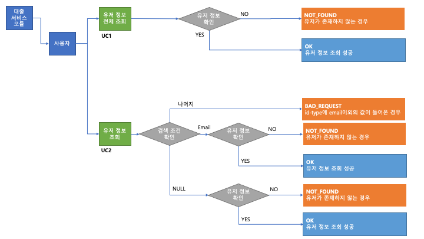
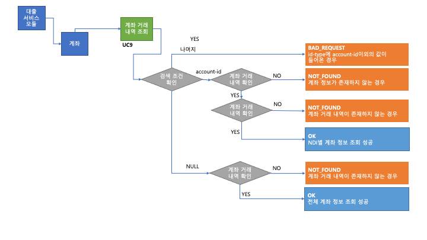

# 202108-internship-loan-system

## REST 명세서


## 플로우 차트 및 유스케이스 명세서

### 유저 정보 조회



### UC1 : 유저 정보 전체 조회

### 메인 시나리오
```
1. 사용자로 부터 Page 조건을 입력 받는다.
2. 유저의 정보를 데이터베이스에서 확인한다.
3. 유저의 정보와 200(OK) 상태를 전송한다.
```

### 서브 시나리오
```
2a. 해당하는 유저의 정보가 존재하지 않을 경우
    1. "사용자가 존재하지 않습니다" 메시지를 저장한다.
    2. 404(NOT_FOUND) 상태를 전송한다.
```

### UC2 : NDI 유저 정보 조회

### 메인 시나리오
```
1. 사용자로 부터 검색 조건을 입력 받는다.
2. 유저의 정보를 데이터베이스에서 확인한다.
3. 유저의 정보와 200(OK) 상태를 전송한다.
```

### 서브 시나리오
```
1a. id-type입력값이 "emai"인 경우
    1. Pathvariable값을 "email"로 확인하여 데이터베이스에서 조회한다.
1b. id-type입력값이 없는 경우
    1. "존재하지 않는 IdType입니다" 메시지를 저장한다.
    2. 400(BAD_REQUEST) 상태를 전송한다.
1c. id-type입력값이 없는 경우
    1. Pathvariable값을 "ndi"로 확인하여 데이터베이스에서 조회한다.
2a. 해당하는 유저의 정보가 존재하지 않을 경우
    1. "사용자가 존재하지 않습니다" 메시지를 저장한다.
    2. 404(NOT_FOUND) 상태를 전송한다.
```

### 유저 정보 추가, 신용 등급 조회


### UC3 : 유저 정보 추가

### 메인 시나리오
```
1. 사용자로 부터 유저 정보를 입력 받는다.
2. 이메일 중복검사를 통해 아이디가 존재한지 확인한다.
3. 유저의 정보를 데이터베이스에서 입력한다.
4. 유저의 정보와 200(OK) 상태를 전송한다.
```

### 서브 시나리오
```
1a. RequestBody가 없는 경우
    1. "입력값이 존재하지 않습니다" 메시지를 저장한다.
    2. 400(BAD_REQUEST) 상태를 전송한다.
1b. RequestBody가 일부 없는 경우
    1. "입력값이 잘못 들어왔습니다" 메시지를 저장한다.
    2. 400(BAD_REQUEST) 상태를 전송한다.
1c. 이메일 조건이 성립되지 않는 경우
    1. "이메일 조건이 정확하지 않습니다" 메시지를 저장한다.
    2. 400(BAD_REQUEST) 상태를 전송한다.
2a. 이미 가입된 이메일이 존재하는 경우
    1. "이메일 조건이 정확하지 않습니다" 메시지를 저장한다.
    2. 400(BAD_REQUEST) 상태를 전송한다.
```
### UC4 : 신용등급 조회

### 메인 시나리오
```
1. 사용자로 부터 NDI을 입력받는다.
2. 신용평가 모듈에 신용등급 조회를 요청한다.
3. 유저의 정보가 존재한지 확인한다.
4. CB 모듈에게 신용등급 조회를 요청한다.
5. 신용동급을 바탕으로 대출 가능 여부를 판단한다.
6. 신용평가 조회 기록과 결과를 신용평가 데이터베이스에 저장한다.
7. 신용평가 모듈에서 대출 서비스 모듈로 결과값을 전달한다.
8. 사용자에게 신용평가 결과 값과 201(CREATED) 상태를 전송한다.
```

### 서브 시나리오
```
2a. 이미 검색된 신용 정보가 존재하는 경우
    1. 신용등급과 결과를 전송한다.
    2. 200(OK) 상태를 전송한다.
2b. 신용평가 모듈에 접근할 수 없는 경우
    1. "신용 등급 서버가 열리지 않았습니다" 메시지를 저장한다.
    2. 500(INTERNAL_SERVER_ERROR) 상태를 전송한다.
3a. 사용자의 유저 정보가 없는 경우
    1. "사용자가 존재하지 않습니다" 메시지를 저장한다.
    2. 404(NOT_FOUND) 상태를 전송한다.
4a. CB서버에 접근할 수 없는 경우
    1. "CB서버가 열리지 않았습니다" 메시지를 저장한다.
    2. 500(INTERNAL_SERVER_ERROR) 상태를 전송한다.
4b. 조회가 10초 이상 걸리는 경우
    1. "CB서버의 제한시간이 초과되었습니다" 메시지를 저장한다.
    2. 504(GATEWAY_TIMEOUT) 상태를 전송한다.
```

### 계좌 정보 조회


### UC5 : 계좌 정보 전체 조회

### 메인 시나리오
```
1. 사용자로 부터 Page 조건과 검색 조건을 입력 받는다.
2. 유저의 정보를 데이터베이스에서 확인한다.
3. 유저의 정보와 200(OK) 상태를 전송한다.
```

### 서브 시나리오
```
1a. "ndi" 값이 입력된 경우
    1. RequestParam ndi를 확인한다.
        1a. RequestParam ndi가 없는 경우
            1. "계좌가 존재하지 않습니다" 메시지를 저장한다.
            2. 404(NOT_FOUND) 상태를 전송한다.
    2. 유저의 정보를 NDI기준으로 검색한다.
1b. "ndi" 값이 없는 경우
    1. 유저의 정보를 조건 없이 검색한다.
2a. 해당하는 계좌 정보가 존재하지 않을 경우
    1. "계좌가 존재하지 않습니다" 메시지를 저장한다.
    2. 404(NOT_FOUND) 상태를 전송한다.
```

### UC6 : 계좌 아이디 별 계좌 정보 전체 조회

### 메인 시나리오
```
1. 사용자로 부터 계좌 아이디를 입력 받는다.
2. 유저의 정보를 데이터베이스에서 확인한다.
3. 유저의 정보와 200(OK) 상태를 전송한다.
```

### 서브 시나리오
```
2a. 계좌 정보가 없는 경우
    1. "계좌가 존재하지 않습니다" 메시지를 저장한다.
    2. 404(NOT_FOUND) 상태를 전송한다.
```

### 마이너스 통장 신청


### UC7 : 마이너스 계좌 신청

### 메인 시나리오
```
1. 사용자로 부터 NDI를 입력 받는다.
2. NDI를 통해서 유저 정보를 확인한다.
3. 계좌 아이디를 통해서 계좌 정보를 확인한다.
4. 신용 등급 조회 결과가 존재한지 확인한다.
5. 대출 가능 여부를 확인한다.
6. 새로운 통장을 데이터베이스에 저장한다.
7. 통장 정보와 201(CREATED) 상태를 전송한다.
```

### 서브 시나리오
```
1a. 입력값이 들어오지 않는 경우
    1. "입력값이 잘못 들어왔습니다" 메시지를 저장한다.
    2. 400(BAD_REQUEST) 상태를 전송한다.
1b. NDI이 잘못 들어온 경우
    1. "NDI 입력값이 잘못되었습니다" 메시지를 저장한다.
    2. 400(BAD_REQUEST) 상태를 전송한다.
2a. 사용자 정보가 없는 경우
    1. "사용자가 존재하지 않습니다" 메시지를 저장한다.
    2. 404(NOT_FOUND) 상태를 전송한다.
3a. 이미 계좌 정보가 존재하는 경우
    1. "이미 계좌를 가지고 있습니다" 메시지를 저장한다.
    2. 400(BAD_REQUEST) 상태를 전송한다.
4a. 신용 등급 조회 결과가 없는 경우
    1. "신용등급이 존재하지 않습니다" 메시지를 저장한다.
    2. 404(NOT_FOUND) 상태를 전송한다.
5a. 대출 조건성립 되지 않은 경우
    1. "신용등급 미달로 대출 신청이 불가능합니다" 메시지를 저장한다.
    2. 400(BAD_REQUEST) 상태를 전송한다.
```

### 대출 신청 및 반환


### UC8 : 대출 신청 및 반환

### 메인 시나리오
```
1. 사용자로 부터 계좌 아이디와 신청 금액를 입력 받는다.
2. 계좌 아이디를 통해서 계좌 정보를 확인한다.
3. 요구된 상황에 맞춰서 대출 신청 혹은 반환을 한다.
4. 통장 정보와 201(CREATED) 상태를 전송한다.
```

### 서브 시나리오
```
1a. RequestBody 입력값이 들어오지 않는 경우
    1. "입력값이 존재하지 않습니다" 메시지를 저장한다.
    2. 400(BAD_REQUEST) 상태를 전송한다.
1a. RequestBody가 일부 없는 경우
    1. "입력값이 잘못 들어왔습니다" 메시지를 저장한다.
    2. 400(BAD_REQUEST) 상태를 전송한다.
1c. 신청 금액이 0 혹은 음수 인경우
    1. "잘못된 금액 신청입니다" 메시지를 저장한다.
    2. 400(BAD_REQUEST) 상태를 전송한다.
2a. 계좌 정보가 없는 경우
    1. "계좌가 존재하지 않습니다" 메시지를 저장한다.
    2. 404(NOT_FOUND) 상태를 전송한다.
2b. 계좌가 이미 해지된 상태 인 경우
    1. "이미 해지된 계좌입니다" 메시지를 저장한다.
    2. 400(BAD_REQUEST) 상태를 전송한다.
3a. 대출 신청인 경우
    1. 대출 신청하면 한도를 초과하는지 확인한다.
        1a. 한도를 초과하는 경우
            1. "대출 한도를 초과하였습니다" 메시지를 저장한다.
            2. 200(OK) 상태를 전송한다.
    2. 대출 신청 후 계좌를 데이터베이스에 저장한다.
3b. 대출 반환인 경우
    1. 대출 반환 후 계좌를 데이터베이스에 저장한다.
    2. 현재 통장 상태를 확인한다.
        2a. 마이너스 통장인 경우
            1. 통장에 반환 금액을 넣는다.
                1a. 반환 금액을 넣은후 잔액이 양수가 아닌 경우
                    1. 반환 기록을 데이터베이스에 저장 한다.
                1b. 반환 금액을 넣은후 잔액이 양수인 경우
                    1. 잔액을 제외한 반환 금액을 반환 기록을 베이터베이스에 저장한다.
        2b. 마이너스 통장이 아닌 경우
            1. 반환 기록 없이 진행한다.
3c. 잘못 된 요구사항인 경우
    1. "입력값이 잘못 들어왔습니다" 메시지를 저장한다.
    2. 400(BAD_REQUEST) 상태를 전송한다.
```

### 거래 내역 조회


### UC9 : 거래 내역 전체 조회

### 메인 시나리오
```
1. 사용자로 부터 Page 조건과 검색 조건을 입력 받는다.
2. 계좌 거래 기록을 데이터베이스에서 확인한다.
3. 유저의 정보와 200(OK) 상태를 전송한다.
```

### 서브 시나리오
```
1a. "account-id" 값이 입력된 경우
    1. RequestParam account-id를 확인한다.
        1a. RequestParam ndi가 없는 경우
            1. "존재하지 않는 IdType입니다" 메시지를 저장한다.
            2. 400(BAD_REQUEST) 상태를 전송한다.
    2. 계좌 정보를 검색한다.
        2a. 해당하는 계좌 정보가 존재하지 않을 경우
            1. "계좌가 존재하지 않습니다" 메시지를 저장한다.
            2. 404(NOT_FOUND) 상태를 전송한다.
1b. "account-id" 값이 없는 경우
    1. 계좌 거래 기록을 조건 없이 검색한다.
2a. 계좌 거래 내역이 없는 경우
    1. "계좌거래내역이 존재하지 않습니다" 메시지를 저장한다.
    2. 404(NOT_FOUND) 상태를 전송한다.
```

### 통장 해지

### UC12 : 마이너스 계좌 해지

### 메인 시나리오
```
1. 사용자로 부터 계좌 아이디를 입력 받는다.
2. 계좌 정보를 확인한다.
3. 통장의 잔고 상태를 확인한다.
4. 통장을 해지 상태로 변경하고 데이터베이스에 저장한다.
5. 남은 잔고와 200(OK) 상태를 전송한다.
```

### 서브 시나리오
```
2a. 계좌 정보가 없는 경우
    1. "계좌가 존재하지 않습니다" 메시지를 저장한다.
    2. 404(NOT_FOUND) 상태를 전송한다.
3a. 이미 계좌가 해지된 상태 인 경우
    1. "이미 해지된 계좌입니다" 메시지를 저장한다.
    2. 400(BAD_REQUEST) 상태를 전송한다.
4a. 통장 잔고가 마이너스인 경우
    1. "잔고가 0이 아닙니다" 메시지를 저장한다.
    2. 400(BAD_REQUEST) 상태를 전송한다.
```


## 데이터베이스

### E-R 다이어그램


### UserDB

1. Docker
``` Terminal
docker run -p 53306:3306 --name UserDB -e MYSQL_ROOT_PASSWORD=naver -e MYSQL_DATABASE="user" -d mysql:latest --character-set-server=utf8mb4 --collation-server=utf8mb4_unicode_ci
```

2. SQL
```SQL
CREATE TABLE user(
    NDI VARCHAR(36) PRIMARY KEY,
    email VARCHAR(50) not null unique,
    user_name VARCHAR(10) not null,
    age INT NOT NULL,
    salary INT NOT NULL
);

CREATE TABLE user_credit_rating(
    NDI VARCHAR(36) PRIMARY KEY,
    grade INT NOT NULL,
    isPermit BOOLEAN NOT NULL,
    created_date DATETIME NOT NULL default(NOW()),
    FOREIGN KEY(NDI) REFERENCES user(NDI)
);
```

### CreditRatingSearchDB

1. Docker
``` Terminal
docker run -p 63306:3306 --name CreditRatingSearchDB -e MYSQL_ROOT_PASSWORD=naver -e MYSQL_DATABASE="credit_rating_search" -d mysql:latest --character-set-server=utf8mb4 --collation-server=utf8mb4_unicode_ci
```

2. SQL
```SQL
CREATE TABLE credit_rating_search_history(
    history_id INT PRIMARY KEY AUTO_INCREMENT,
    NDI VARCHAR(36) NOT NULL,
    grade INT NOT NULL,
    created_date DATETIME NOT NULL default(NOW())
);

CREATE TABLE credit_rating_search_result(
    NDI VARCHAR(36) PRIMARY KEY,
    grade INT NOT NULL,
    history_id INT NOT NULL,
    isPermit BOOLEAN NOT NULL,
    FOREIGN KEY(history_id) references credit_rating_search_history(history_id)
);

```
### AccountDB

1. Docker
``` Terminal
docker run -p 43306:3306 --name AccountDB -e MYSQL_ROOT_PASSWORD=naver -e MYSQL_DATABASE="account" -d mysql:latest --character-set-server=utf8mb4 --collation-server=utf8mb4_unicode_ci
```
2. SQL
```SQL
CREATE TABLE account(
    account_id INT PRIMARY KEY AUTO_INCREMENT,
    account_number VARCHAR(50) NOT NULL UNIQUE,
    NDI VARCHAR(36) NOT NULL,
    loan_limit INT NOT NULL,
    balance INT NOT NULL,
    grade INT NOT NULL,
    status VARCHAR(15) NOT NULL default("normal"),
    created_date DATETIME NOT NULL default(NOW()),
    cancelled_date DATETIME
);

ALTER TABLE account ADD INDEX (account_number);

CREATE TABLE account_transaction_history(
    history_id INT PRIMARY KEY AUTO_INCREMENT,
    account_id INT NOT NULL,
    account_number VARCHAR(30) NOT NULL,
    amount INT NOT NULL,
    type VARCHAR(15) NOT NULL,
    translated_date DATETIME NOT NULL default(NOW()),
    FOREIGN KEY(account_id) REFERENCES account(account_id),
    FOREIGN KEY(account_number) REFERENCES account(account_number)
);

CREATE TABLE account_cancellation_history(
    account_id INT PRIMARY KEY,
    cancellation_date DATETIME NOT NULL,
    FOREIGN KEY(account_id) REFERENCES account(account_id)
);

```

## 실행방법

1. Docker를 통해서 서버 3개 실행

2. CB 모듈 실행
- [CB모듈](https://oss.navercorp.com/finance-css/intern-dummy-cb)

3. creditRating Spring Boot 실행

4. loanService Spring Boot 실행

## 부하 테스트

|유스케이스|테스트케이스|동시접속수|실행시간|총 요청 건수|실패 요청 건수|TPS|TPS(across all concurrent requests)|
|------|---|---|---|---|---|---|---|
|UC1|200개|200개|5s|2732개|0개|366.285ms|1.831ms|
|UC2|200개|200개|5s|11977개|0개|83.501ms|0.418ms|
|UC3|200개|200개|5s|10829개|0개|92.352ms|0.462ms|
|UC4|200개|200개|X|200개|197개|28174.503ms|140.873ms|
|UC5|200개|200개|5s|1253개|0개|881.286ms|4.406ms|
|UC6|200개|200개|5s|2772개|0개|360.819ms|1.804ms|
|UC7|200개|200개|5s|1943개|0개|514.762ms|2.574ms|
|UC8|200개|200개|5s|516개|0개|1938.421ms|9.692ms|
|UC9|200개|200개|5s|539개|0개|1863.708ms|9.319ms|

- UC10은 DELETE여서 ab 테스트 불가